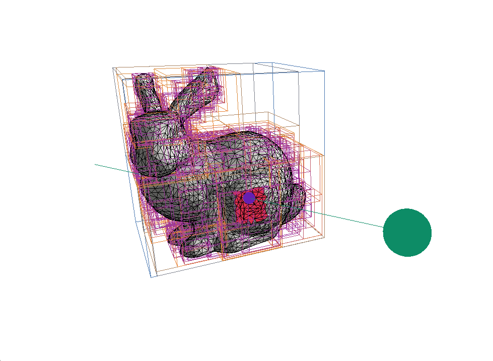

# BVH Visualizer

An interactive 3D tool for exploring how a **Bounding Volume Hierarchy (BVH)** accelerates ray–triangle intersection tests. Load any OBJ mesh, fire a ray through the scene, and watch the hierarchy prune the search space in real time — with live statistics on box tests, triangle tests, and traversal depth.

The BVH is built with the **Surface Area Heuristic (SAH)** using an 8-bin sweep, producing a compact, well-balanced tree that minimises the expected intersection cost.



---

## Features

- **SAH BVH construction** — 8-bin sweep over all three axes; falls back gracefully when splitting is not beneficial.
- **Interactive ray** — drag the ray's origin and direction with a 3-D gizmo (translate / rotate / universal handle) or type exact values in the control panel.
- **Depth-limited traversal** — a slider lets you step through the tree level by level to see exactly which bounding boxes are tested at each depth.
- **Live statistics** — the UI reports bounding-box tests, triangle tests, and total triangle count for every frame.
- **Rendering controls** — toggle BVH box overlay, ray, wireframe borders, and hit-face highlighting; adjust mesh opacity and line width.
- **Dynamic model loading** — enter any `.obj` path at runtime and hot-reload the mesh and BVH without restarting.
- **Free-fly camera** — WASD + QE keyboard movement, right-click-drag to look, scroll to dolly.
- **ImGui / ImGuizmo UI** — clean light-theme panel docked to the right side of the window.

---

## Dependencies

### System packages (must be installed manually)

| Package | Purpose |
|---------|---------|
| CMake ≥ 3.20 | Build system |
| GCC / Clang (C++17) | Compiler |
| GLFW 3 | Window & input |
| GLM | Math (headers only) |
| OpenGL / Mesa | Rendering |

**Arch Linux**
```bash
sudo pacman -S cmake gcc glfw glm mesa
```

**Ubuntu / Debian**
```bash
sudo apt install cmake g++ libglfw3-dev libglm-dev libgl1-mesa-dev
```

### Automatically fetched by CMake (`FetchContent`)

| Library | Version / Commit | Purpose |
|---------|-----------------|---------|
| [Dear ImGui](https://github.com/ocornut/imgui) | v1.90.8 | UI panels |
| [ImGuizmo](https://github.com/CedricGuillemet/ImGuizmo) | latest | 3-D transform gizmo |
| [tinyobjloader](https://github.com/tinyobjloader/tinyobjloader) | `966edce` | OBJ mesh loading |
| [GLAD](vendor/glad) | vendored | OpenGL loader |

---

## Build Instructions

```bash
# 1. Clone the repository
git clone https://github.com/Shivraj1906/BVH-Visualization.git
cd BVH-Visualization

# 2. Configure and build (CMake fetches ImGui / ImGuizmo / tinyobjloader automatically)
mkdir build && cd build
cmake .. -DCMAKE_BUILD_TYPE=Release
make -j$(nproc)

# 3. Run
./bvh_visualizer
```

> **Note:** The first build downloads the auto-fetched libraries and may take a minute longer than subsequent builds.

---

## Controls

### Camera

| Input | Action |
|-------|--------|
| **W / S** | Move forward / backward |
| **A / D** | Strafe left / right |
| **E / Q** | Move up / down |
| **Right-click + drag** | Look around |
| **Scroll wheel** | Dolly in / out |

### Ray gizmo

| Input | Action |
|-------|--------|
| **Left-click + drag** on gizmo | Translate or rotate the ray origin |
| *Translate / Rotate / Universal* radio buttons | Switch gizmo mode |

---

## UI Panel Reference

| Section | Controls |
|---------|---------|
| **BVH Controls** | Enable/disable BVH; set max traversal depth |
| **Camera Tools** | Move speed, look sensitivity, reset camera |
| **Ray Controls** | Gizmo mode; ray-origin XYZ and Euler rotation sliders; origin-sphere radius |
| **Statistics** | Box tests, triangle tests, total triangle count (live) |
| **Display** | Show/hide BVH boxes, ray, wireframes, hit-face highlight; mesh opacity; line & dot size |
| **Model Loader** | Enter an OBJ file path and click *Load Mesh* to hot-reload |

---

## Project Structure

```
BVH-Visualization/
├── src/
│   ├── main.cpp        # Window, camera, ImGui/ImGuizmo render loop
│   ├── BVH.h / .cpp    # AABB, BVHNode, SAH construction & traversal
│   ├── Mesh.h / .cpp   # Triangle storage and OBJ loading (tinyobjloader)
│   ├── Ray.h           # Ray struct with precomputed inverse direction
│   ├── Scene.h / .cpp  # Ties BVH, Mesh, Renderer together; traversal stats
│   ├── Renderer.h / .cpp # OpenGL draw calls for mesh, BVH boxes, ray
│   └── shaders/        # GLSL vertex & fragment shaders (mesh, bbox, ray)
├── vendor/
│   └── glad/           # Vendored OpenGL loader
└── CMakeLists.txt
```

---

## How It Works

1. **Build** — `BVH::build()` recursively subdivides the triangle set. At each node it evaluates the SAH cost across 8 bins on all three axes and picks the split with the lowest expected traversal cost. Splitting stops when the node holds ≤ 2 triangles or when no split improves on the leaf cost.
2. **Traverse** — `BVH::traverse()` walks the tree for the current ray. At each node it performs an AABB slab test; misses are skipped entirely. Traversal stops early at the user-selected depth so you can observe the culling process step by step.
3. **Render** — The renderer draws the mesh (with optional transparency), wireframe edges, the BVH bounding boxes in a depth-coded colour, and the ray with a sphere at its origin. Hit triangles are highlighted in a distinct colour.

